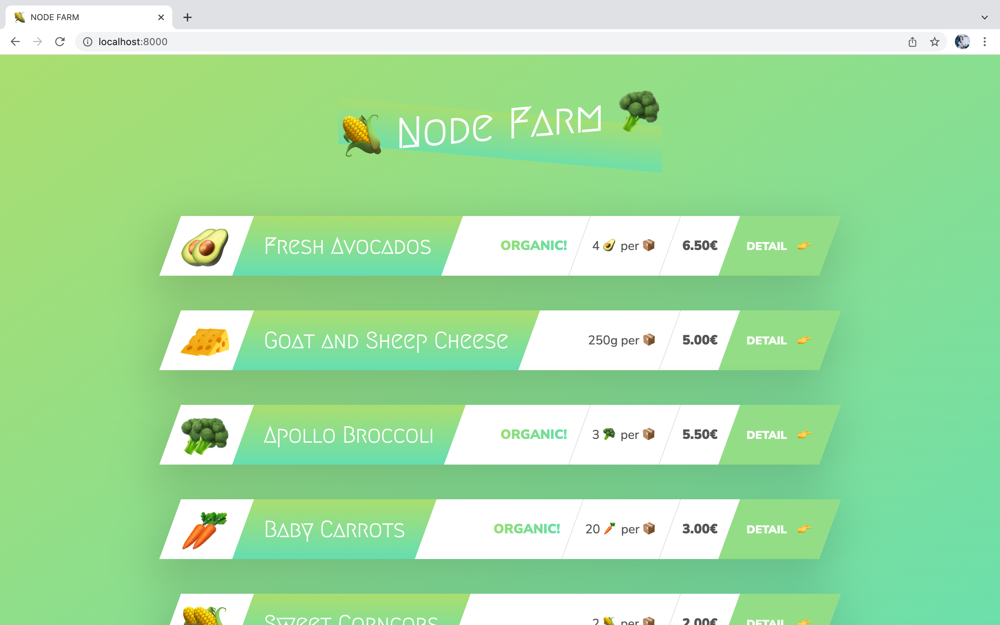
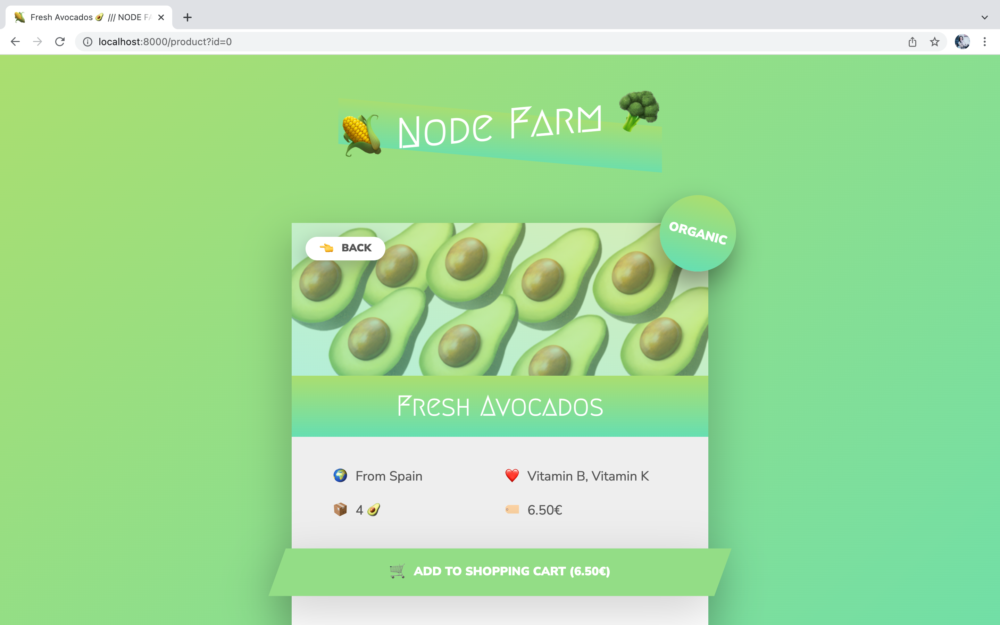

# node-farm

A web page with list of products/groceries and information about them. A Node.js exercise project.

## How to run locally

- Fork and clone repository
- Open new terminal in project's root folder
- run `npm install` -> to install all dependencies
- run `npm start` -> to start local server
- The app will be running on port 8000  
  [http://127.0.0.1:8000/](http://127.0.0.1:8000/)

## Screenshots

- Overview page
  
- Product details page
  

## Final notes

- Adding items to basket was not intended to be implemented in this exercise project.
